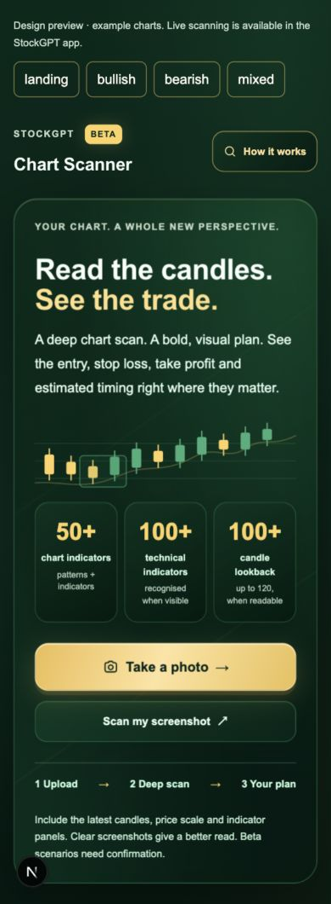
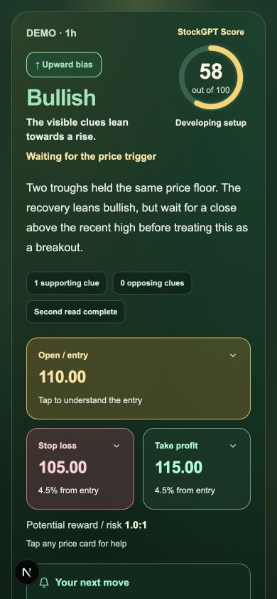
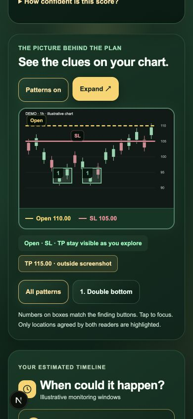

# StockGPT improvement review

Reviewed 7 October 2026. This is a code-based product and conversion review, not a measured conversion study or a claim that the scanner predicts profitable trades. Live customer data, real scan accuracy, Stripe Price amounts, production latency and subscription conversion were not queried.

## Changes completed in this pass: offer clarity

- Removed the fictional places-left counter. It previously dropped by 20 each UTC day and reset every seven days, regardless of purchases. The founding offer remains visible without an invented number of customers or remaining places.
- Replaced the global price-text MutationObserver with a normal reusable price component. Monthly offer pricing now appears in the initial server HTML and keeps the existing green/gold appearance: **£4.99/month**, with **£18.99** identified as standard monthly pricing.
- Corrected pricing, checkout confirmation, both landing-page price displays, the offer popup and the saved-offer signup message. Removed unconditional free-trial and 50%-off promises from those displays. Trials still depend on existing checkout configuration.
- Removed the annual “best value / two months free” framing while the cheaper monthly offer is being sold. The annual amount and Stripe charging logic were left unchanged.
- Two regression checks render the real offer components without browser effects, verify the offer and standard price are present in server HTML, and reject invented remaining-place claims. Targeted lint passed.

The billing route always selects the existing limited-offer monthly Price ID. The £4.99 amount is the repository's stated offer; the actual Stripe Price was not retrieved. Before release, verify that the configured Price is GBP 499 per month, confirm trial behavior and renewal terms, and check the annual promotion's actual duration and amount. This pass does not change what Stripe charges.

Evidence: [offer copy](/Users/joefisher/.codex/.chatgpt-projects/g-p-6ac5ed5f663481918001b9edd71ff8ab/stockgpt-web/lib/limited-offer.ts), [checkout charging policy](/Users/joefisher/.codex/.chatgpt-projects/g-p-6ac5ed5f663481918001b9edd71ff8ab/stockgpt-web/app/api/create-checkout-session/route.ts:37), [SSR checks](/Users/joefisher/.codex/.chatgpt-projects/g-p-6ac5ed5f663481918001b9edd71ff8ab/stockgpt-web/scripts/offer-display-checks.mjs).

The [FTC's primary report on dark patterns](https://www.ftc.gov/reports/bringing-dark-patterns-light) identifies false urgency and scarcity as misleading patterns. That supports using genuine launch terms or purchase-backed counts; this review is not a legal finding about StockGPT.

## Highest-priority next improvements

| Priority | Improvement | Why it matters | Evidence and measurement |
| --- | --- | --- | --- |
| 1 | Establish a scanner benchmark before advertising accuracy | Multiple model reads and pattern catalog size do not establish market prediction accuracy. Separate “read the image correctly” from “trade outcome.” | Existing scanner tests exercise parsing, coordinates and scenarios. Add a held-out collection with independently labeled ticker/timeframe, axis ticks, candle shapes and trigger status. Measure price/overlay error, false detections, justified abstentions and model agreement. |
| 1 | Complete the conversion funnel measurement | Existing events cover demo progression, offer interactions and signup start. This pass adds scan start, success, failure, cancellation and share events, but the path to paid subscriptions is still incomplete. | Connect the new scanner events to result engagement, signup verification, checkout creation and webhook-confirmed first paid invoice. Report p50/p95 latency, cost per usable scan, paid conversion and 7-day retention. Use safe metadata, not chart images, emails or holdings. |
| 1 | Decide and enforce a clear scan allowance | The scanner API currently checks login and an app user-agent but has no explicit subscription or rate/budget check. Promoting it can increase AI cost without an upgrade path. | Offer one useful scan or a transparent small allowance, then show a specific plan benefit. Enforce usage server-side and disclose limits before purchase. Measure cost per new payer and scan completion alongside conversion. This is a recommendation, not a new paywall implemented in this pass. |
| 2 | Give visitors a scanner demonstration before account creation | The site's main story and iPhone welcome tour show rankings, portfolio, news and chat, while the scanner is absent. `/chart-scan` redirects normal browsers. | Add a labeled sample screenshot → annotated result preview and a short recording from the real app. Make availability explicit. Measure demo-to-verified-account and account-to-paid conversion, not video views alone. |
| 2 | Reduce signup work | Email signup presents five identity/login fields, four consent rows, then verification. Optional marketing and newsletter choices compete with the first useful experience. | Move optional preferences into onboarding; simplify name collection; reassess whether a full date of birth is needed when social signup uses an 18+ confirmation. Preserve the required age/auth/consent policy. Test verified signup rate, first scan rate and errors. |
| 2 | Preserve the fun style while shortening the route to value | The homepage uses a 900vh scroll sequence and a timed 1.4-second preloader followed by its exit transition. People coming from a short clip may want to try what they just saw. | Keep the cinematic story, but add a prominent “See a sample scan” route and test the timed preloader's removal. Compare first-value time and paid conversion. Reduced-motion fallback already exists. |
| 3 | Make scanning a repeatable research workflow | Results live in component state. A refresh/new scan clears them; the user cannot compare the same chart later. | Add explicit opt-in saved scans with timestamp, source screenshot context and scenario changes. Start with save/revisit; consider alerts only after a reliable data-backed trigger exists. Measure return visits and repeat useful scans. |
| 3 | Use one plan name across the journey | The new homepage calls the paid plan “Pro,” while pricing and checkout call it “Core.” | Align naming and entitlements after confirming the intended product name. Measure pricing-to-checkout completion and questions about access. |

Code evidence: [current scan access](/Users/joefisher/.codex/.chatgpt-projects/g-p-6ac5ed5f663481918001b9edd71ff8ab/stockgpt-web/app/api/chart-scan/route.ts:120), [main landing story](/Users/joefisher/.codex/.chatgpt-projects/g-p-6ac5ed5f663481918001b9edd71ff8ab/stockgpt-web/app/landing/ScrollLandingClient.tsx:94), [iPhone welcome tour](/Users/joefisher/.codex/.chatgpt-projects/g-p-6ac5ed5f663481918001b9edd71ff8ab/stockgpt-web/app/welcome/WelcomeCarousel.tsx:8), [signup](/Users/joefisher/.codex/.chatgpt-projects/g-p-6ac5ed5f663481918001b9edd71ff8ab/stockgpt-web/app/signup/page.tsx), [client analytics](/Users/joefisher/.codex/.chatgpt-projects/g-p-6ac5ed5f663481918001b9edd71ff8ab/stockgpt-web/lib/analytics/client-events.ts), [billing webhook](/Users/joefisher/.codex/.chatgpt-projects/g-p-6ac5ed5f663481918001b9edd71ff8ab/stockgpt-web/app/api/stripe-webhook/route.ts).

[Baymard's primary checkout research](https://baymard.com/research-articles/checkout-flow-average-form-fields) finds that the fields people must consider matter more to usability than the number of steps. This supports testing a lighter signup. Its ecommerce results are not a promised conversion lift for StockGPT.

## Scanner accuracy and information roadmap

1. Build the benchmark from real-world chart styles: dark/light themes, TradingView/Trading 212, linear/log/inverted axes, tiny-priced assets, cropped labels, line charts, blurry camera photos, multiple panels and still-forming candles. Have reviewers label image facts before seeing model output. Keep training examples separate from the held-out evaluation set.
2. Show or ask users to confirm ticker, timeframe, exchange, screenshot time and whether the latest candle is closed. A screenshot-based scan should say how old its evidence is; a fresh market quote does not itself validate a candle pattern.
3. For stronger numerical accuracy, explore an optional data-backed mode using verified OHLC candles for the confirmed asset/timeframe. Calculate candle rules and levels from data; use image analysis for annotations and visible context. Do not silently substitute a different symbol, session or timeframe.
4. Distinguish observed evidence, model interpretation and estimated/practice levels throughout results. The existing setup score is explicitly heuristic, not a win probability. Agreement between readers is useful evidence about consistency, not proof of truth.
5. Measure actual latency and provider cost before changing models. Consider exact-input caching with appropriate retention and context keys, but never let an old cached screenshot masquerade as current market analysis.

Already present and worth retaining: separate layout/analysis/review stages, readable-axis checks, overlay geometry validation, reference-price fallback labeling, two-image support, retake handling, model-disagreement score caps, counterarguments, trigger/invalidation explanations and detailed pattern/indicator checks. The next gains should come from measured failures and verified data rather than another large checklist of patterns.

## Purchases and hype: practical experiments

| Experiment | Concrete creative/product change | Primary success metric | Guardrail |
| --- | --- | --- | --- |
| Show the scanner immediately | A real 10–15 second clip: upload screenshot, highlight one pattern, reveal a conditional scenario | Verified accounts and paid subscriptions per visitor | Failed scan rate and honest app availability |
| Let users experience value | Sample scan without signup, followed by a clearly disclosed first personal-scan allowance | Personal usable scans → paid subscriptions | AI cost, useful-result rate and abuse |
| Replace feature-count messaging | “Screenshot in. Chart clues explained.” Show entry/exit scenario, conflicting clues and the annotated source | Paid conversion after result viewing | No promise of profits, exact timing or unmeasured accuracy |
| Test authentic proof | Opt-in customer quotes about understanding/time saved; a public, reproducible image-reading benchmark when available | Paid conversion and retained users | No invented usage counts, testimonials or cherry-picked return claims |
| Make results shareable | Optional annotated image/result card with screenshot timestamp, scenario labels and personal details removed | Referred visitors → verified accounts → paid subscriptions | User consent, privacy and preserved uncertainty labels |

Run one major conversion experiment at a time until traffic supports reliable comparisons. Avoid declaring a winner from a few purchases. Prefer qualified conversion and retention over clicks: exaggerated certainty can produce attention while increasing refunds and weakening trust.

## Scanner and experience changes completed

- Continued the latest “Modify app for Xcode preview” work from the 44-pattern Beta update, preserving the existing edits. The scanner keeps the dark green/gold palette, stronger translucent pattern highlights and persistent calibrated entry/exit lines.
- Added layered dark emerald gradients to the scanner's scrolling content backdrop and cards, with restrained gold accents. Removed the broad gold wash that made the green look pale. The backdrop is scoped to the scanner content pane.
- Results now show a large green Bullish, red Bearish or gold No clear edge headline tied to the actual verdict. An inconclusive result cannot inherit a directional headline merely from its fallback plan. Missing defensible prices say “Not established.”
- Moved the annotated chart ahead of the timeline; entry/SL/TP use short labels in separate horizontal lanes, with full prices below. Added a sticky close header to the capability dialog. The 44-pattern catalog is available in a disclosure with search.
- Removed the haptic intensity setting and duplicate scanner feedback from the global listener. Tap/open/scan/completion/warning/error have deliberate native feedback; automatic details-toggle events no longer create phantom pulses. The existing native UIKit bridge is reused. [Apple's haptic guidance](https://developer.apple.com/design/human-interface-guidelines/playing-haptics) supports using feedback to complement meaningful interactions.
- Made “Take a photo” the main gold action, with “Scan my screenshot” directly below in dark green. Added gentle candle movement, a pulsing pattern highlight and a drawing gold trace, all respecting reduced-motion preferences. The optional reference-price field is behind a disclosure. Added elapsed scan time, cancellation and a bounded timeout that retains the selected chart for retry. Elapsed time is a clock, not a fabricated stage-completion percentage.
- Headline counts now show 50+ chart indicators, 100+ technical indicators and 100+ candle lookback. The first includes 44 candle patterns and nine core indicator tools. Added a separate catalog of 110 canonical non-candle technical indicator types, with aliases, categories and guidance for visible evidence. Names and aliases were checked against the primary [TradingView](https://www.tradingview.com/support/folders/43000587405-built-in-indicators/), [Pandas TA Classic](https://xgboosted.github.io/pandas-ta-classic/indicators.html), [TA-Lib](https://ta-lib.github.io/ta-lib-python/funcs.html) and MetaQuotes documentation. Aliases, period variants and component lines do not inflate the count. This catalog supports recognising labelled plots already visible in an upload; it does not calculate hidden indicator values or establish a measured accuracy rate. Only relevant indicator guidance is sent to the readers, and the visible-region inventory remains bounded.
- Extended the requested lookback to up to 120 readable completed candles. The prompt explicitly allows fewer candles when the image contains less readable history, excludes live candles and forbids bridging cropped gaps or inventing hidden candles. The UI qualifies the 100+ capacity with the readable-image limit.
- Indicator findings now require both independent readers to report a readable label and specific evidence for the same region. Catalog aliases resolve to one identity. Wrong identities, missing names and mismatched sources cannot confirm an indicator signal. Reviewer-only discoveries remain visible as unconfirmed text, and repeated indicators in different panes cannot borrow agreement.
- Added optional text sharing through the device share sheet or clipboard. Shared text retains the setup-score meaning and screenshot/scenario assumptions; it does not automatically include the uploaded chart image. Added aggregate scanner events without ticker, prices, image or account data in event properties.
- Independent review now exposes clear ticker/timeframe/chart-type/direction and numeric-price-read disagreement. Equivalent ticker formatting and 1h/60m timeframes are treated consistently. Useful supported direction remains visible with a lower score and conditional trigger.
- Price overlays require explicit axis confirmation from both readers. A candle is labeled completed only when both readers identify it as closed, and repeated model signals cannot bypass the forming-candle confidence cap.
- The reviewer callback receives the chart inventory without the first reader's thesis. Pass reporting counts dispatched provider requests. Client cancellation reaches provider fetches and prevents later stages from starting when the disconnect signal arrives; remote provider work/billing termination is not guaranteed.

These are reliability fixes, not a measured increase in profitable trades. The model stages remain sequential; latency and provider-cost improvements need representative timings before choosing parallel execution, caching or response-schema enforcement.

## Visual review

Checked the real components with a clearly labeled synthetic example at 320px, 390px and 1200px widths. Bullish, bearish and mixed states stayed inside the viewport. Checked capability tabs, the compact catalog, chart expansion, two distinct trough highlights, permanent calibrated exits and explicit off-chart target labels. This preview does not call the AI provider or establish real-chart accuracy.

[Open the local development preview](http://127.0.0.1:3099/scanner-review-preview). The page is development-only; the production output contains the HTTP 404 fallback and no example scan copy.

## Final validation

Passed 137 scanner regression checks, 2 offer-display checks, portfolio reliability/workspace checks, focused ESLint, TypeScript and the full optimized production build using webpack. Visual checks covered 320px, 390px and 1200px layouts. The initial sandboxed Turbopack build stalled; the production webpack build completed successfully. No claim is made that a live AI scan or trading backtest passed. Native iPhone haptic feel, landscape camera return, real provider scans and the configured Stripe Price amount still require device/production checks. Validation covers this reviewed source. Git history records pushed changes; production deployment status must be checked on the hosting platform.
